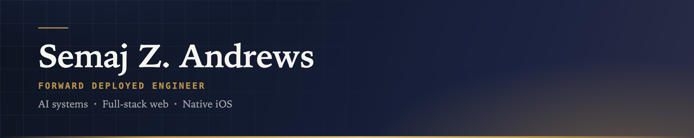
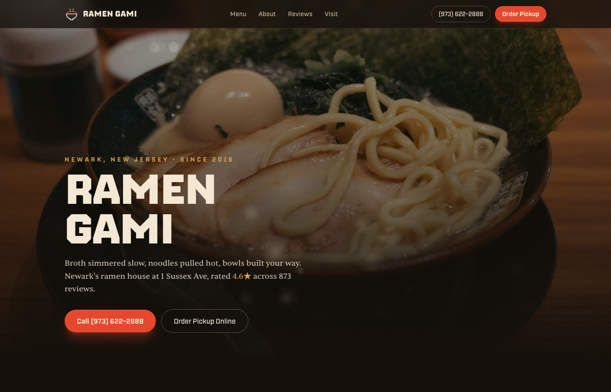
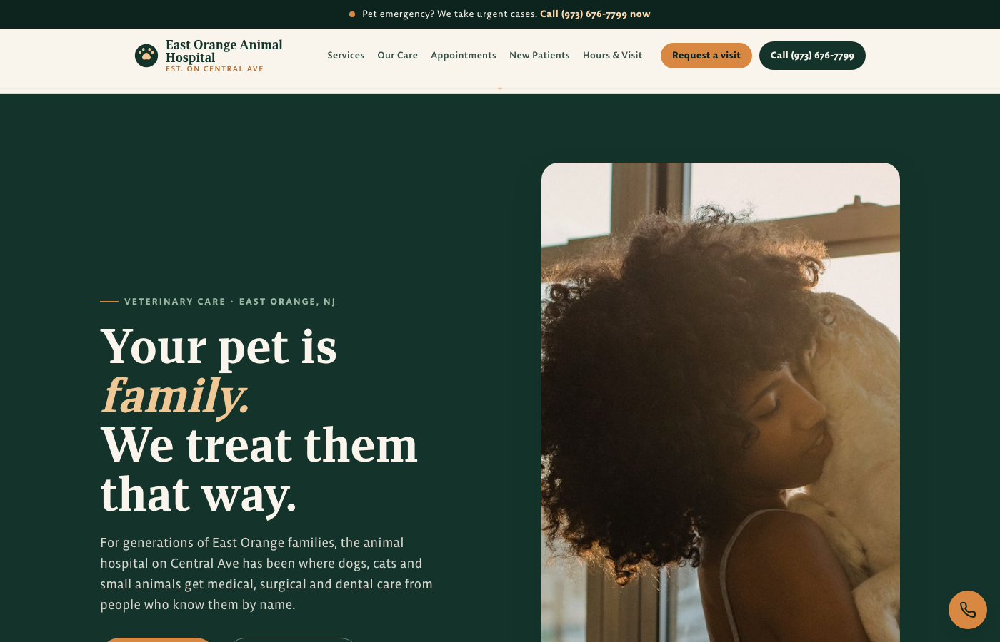
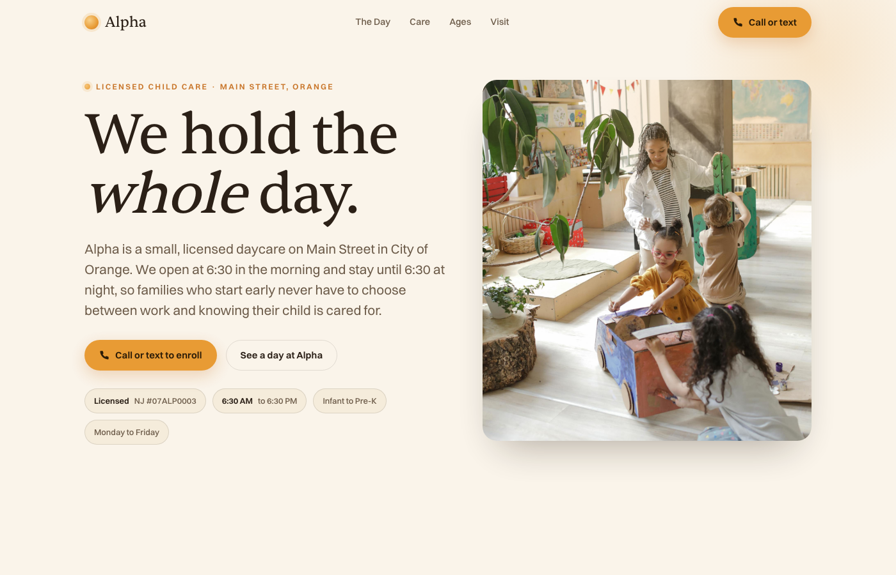
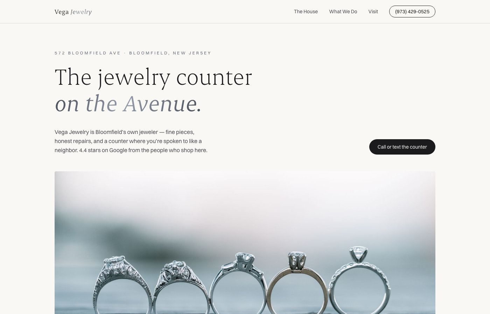
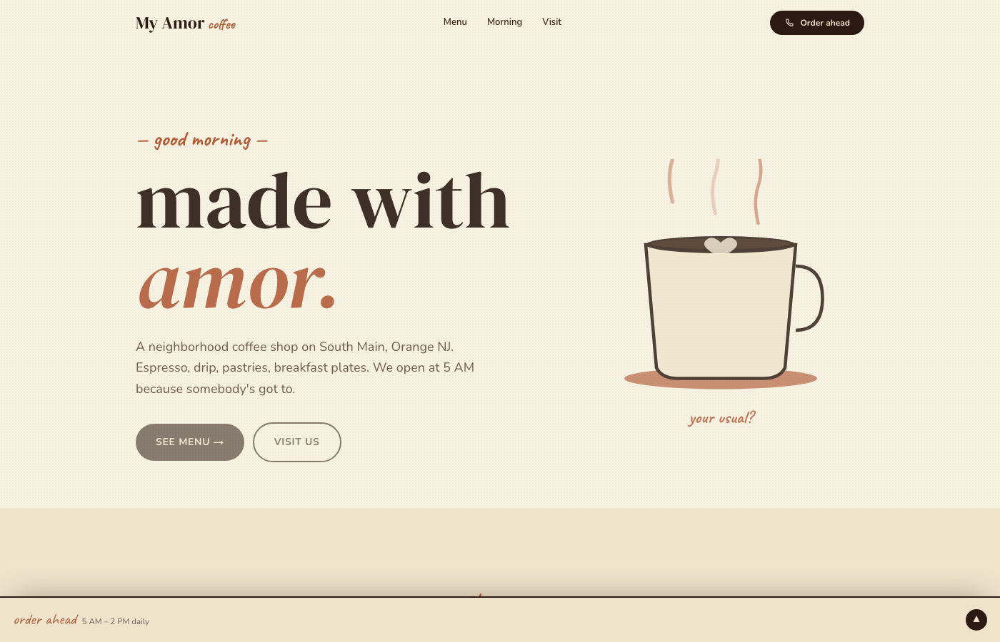
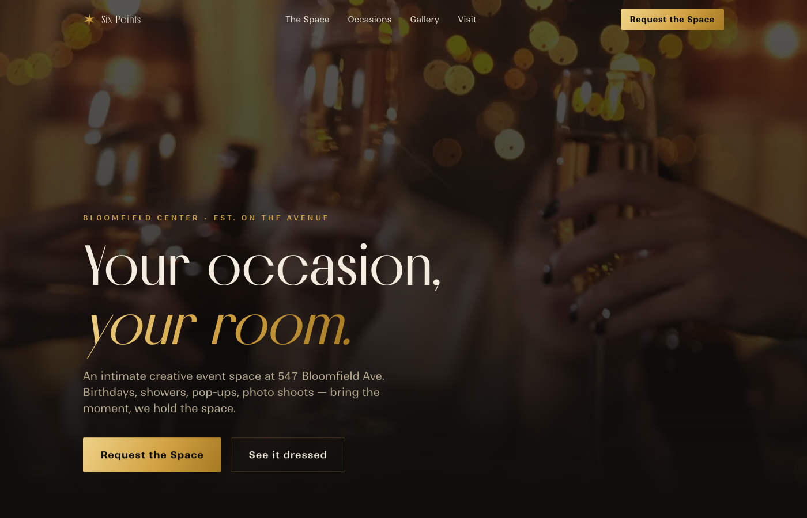

<!-- ═══════════════════════════════════════════════════════════════════════ -->
<!--                        SEMAJ Z. ANDREWS · README                         -->
<!-- ═══════════════════════════════════════════════════════════════════════ -->

 

 

<table width="100%">
<tr>
<td align="center">

> ### *I build across AI, web, and mobile, and ship it.*
>
> **Forward Deployed Engineer** with 7+ years building and shipping production software end to end, close to the customer. I architect and run a multi-agent AI build pipeline, have shipped **90+ projects including 84 live web applications**, and built native iOS apps for Fortune 500 clients. I move fluently across AI systems (Claude API, MCP, multi-agent orchestration), full-stack web (React, Next.js, TypeScript), and native iOS (Swift, SwiftUI), and I own the full lifecycle from design through deployment and the customer relationship.
>
> Newark, NJ · open to remote, hybrid, or on-site

</td>
</tr>
</table>

 

<!-- ───────────────────────── SELECTED PROJECTS ───────────────────────── -->

<h2 align="center">⚡ Selected Projects</h2>

<table>
<tr>
<td width="50%" valign="top">

### 🤖 IGRIS
**Autonomous AI Build System**

Architected an AI-powered system that autonomously generates award-winning websites through a four-phase pipeline (Brief → Design → Atomization → Execution) with multi-agent orchestration. Produces agency-quality output in hours that traditionally costs $5,000 to $50,000+.

`React` `Next.js` `Claude API` `MCP`

**[Case study →](https://bysemaj.com/projects/igris)**

</td>
<td width="50%" valign="top">

### 🖥️ Mac Mini Scan
**Real-Time Apple Store Inventory Locator**

Built a locator that tracks Mac Mini and Mac Studio availability across every Apple Store in the US in real time, built for the supply shortage driven by surging RAM demand and local-AI adoption. Used it to source and resell **$93,000** of inventory in a single month at roughly **$10,000** net profit.

`Python` `Web Scraping` `Real-Time Monitoring`

**[Case study →](https://bysemaj.com/projects/mac-mini-scan)**

</td>
</tr>
<tr>
<td width="50%" valign="top">

### 🛒 BuildWhatYouWant
**AI Sales Conversion Platform**

Developed a platform that sources leads via the Google Business API, generates AI landing pages, delivers previews via QR code with PIN access, and processes orders through Stripe with industry-specific add-ons.

`Next.js` `Tailwind` `Stripe` `Supabase`

**[Case study →](https://bysemaj.com/projects/buildwhatyouwant)**

</td>
<td width="50%" valign="top">

### 🏭 AI Software Factory
**One-Person Agency OS**

The operating system around IGRIS: a gated four-phase pipeline, six specialist agents each with their own prompt and mandate, and one spec that produces web, iOS, Android, PWA, and Chrome extension targets.

`Claude API` `MCP` `React` `Next.js` `Tailwind`

**[Case study →](https://bysemaj.com/projects/ai-software-factory)**

</td>
</tr>
</table>

 

<!-- ───────────────────────── SELECTED LIVE WORK ───────────────────────── -->

<h2 align="center">🎨 Selected Live Websites</h2>

<strong>84 bespoke business websites designed and deployed to production</strong> <em>Each individually built (no templates), responsive, and live in the browser.</em>

<table>
  <tr>
    <td width="50%" align="center">
      
        
      <strong>Ramen Gami</strong> · Restaurant 
      Steam rises off the broth; a full direct-ordering demo lives at <code>/order</code> 
      <a href="https://ramen-gami.vercel.app">→ View live</a>
    </td>
    <td width="50%" align="center">
      
        
      <strong>East Orange Animal Hospital</strong> · Veterinary 
      A resting-heartbeat EKG beats through the page; real-hours appointment and intake demos 
      <a href="https://east-orange-animal-hospital.vercel.app">→ View live</a>
    </td>
  </tr>
  <tr>
    <td width="50%" align="center">
      
        
      <strong>Alpha Daycare Center</strong> · Childcare 
      Soft, reassuring childcare hero built around a "We hold the whole day" headline 
      <a href="https://alpha-daycare-center.vercel.app">→ View live</a>
    </td>
    <td width="50%" align="center">
      
        
      <strong>Vega Jewelry</strong> · Jewelry 
      Monochrome vitrine; the jewelry is the only color on the page 
      <a href="https://vega-jewelry.vercel.app">→ View live</a>
    </td>
  </tr>
  <tr>
    <td width="50%" align="center">
      
        
      <strong>My Amor Coffee Shop</strong> · Cafe 
      Third-wave aesthetic around a hand-drawn cup · Next.js 16 · Motion · SVG · Tailwind v4 
      <a href="https://my-amor-coffee.vercel.app">→ View live</a>
    </td>
    <td width="50%" align="center">
      
        
      <strong>Six Points Creative Spaces</strong> · Creative Studio 
      Editorial event-space site with flexible room layouts and a request-the-space flow 
      <a href="https://six-points-creative-spaces.vercel.app">→ View live</a>
    </td>
  </tr>
</table>

 

<em>More from the 84, best-first:</em>

<table align="center" width="100%">
<tr>
  <td width="50%"><a href="https://ll-massage-spa.vercel.app"><strong>L&amp;L Massage Spa</strong></a> · Booking + intake demo</td>
  <td width="50%"><a href="https://pour-abbeys.vercel.app"><strong>Pour Abbey's Bar &amp; Grill</strong></a> · Order-ahead demo</td>
</tr>
<tr>
  <td><a href="https://kador-beauty-salon.vercel.app"><strong>Kador Beauty Salon</strong></a> · Beauty Salon</td>
  <td><a href="https://gq-cutz-barber-boutique.vercel.app"><strong>GQ Cutz Barber Boutique</strong></a> · Barbershop</td>
</tr>
<tr>
  <td><a href="https://more-more-now-records.vercel.app"><strong>More More Now Records</strong></a> · Record Shop</td>
  <td><a href="https://cantina-443.vercel.app"><strong>Cantina 443</strong></a> · Restaurant</td>
</tr>
<tr>
  <td><a href="https://nails-fever-spa.vercel.app"><strong>Nails Fever Spa</strong></a> · Three.js · Framer Motion</td>
  <td><a href="https://systemomtics-site.vercel.app"><strong>Systemomtics</strong></a> · Lenis · GSAP</td>
</tr>
<tr>
  <td><a href="https://big-sexxy-sauce.vercel.app"><strong>Big Sexxy Hot Sauce</strong></a> · Next.js 15 · particle FX</td>
  <td><a href="https://southern-komfort-site.vercel.app"><strong>Southern Komfort</strong></a> · Next.js 15 · Framer Motion</td>
</tr>
<tr>
  <td><a href="https://email-development-portfolio.vercel.app"><strong>Email Development Portfolio</strong></a> · Hand-coded, cross-client tested</td>
  <td><a href="https://semaj-portfolio-website.vercel.app"><strong>Personal Portfolio</strong></a> · Next.js · Tailwind</td>
</tr>
</table>

<strong><a href="https://bysemaj.com">Full portfolio of all 84 live websites at bysemaj.com →</a></strong>

 

<!-- ───────────────────────── CORE SKILLS ───────────────────────── -->

<h2 align="center">🧠 Core Skills</h2>

#### AI & Automation

#### Languages · Frontend · Mobile · Backend · DevOps

  

<table align="center" width="100%">
<tr><td><strong>Languages</strong></td><td>Swift, Python, TypeScript, JavaScript, Java, C++, SQL, HTML, CSS</td></tr>
<tr><td><strong>Frontend</strong></td><td>React, Next.js 16, Vite, Tailwind CSS v4, GSAP, Framer Motion, Three.js, shadcn/ui</td></tr>
<tr><td><strong>Mobile</strong></td><td>SwiftUI, UIKit, Xcode, Core Data, MapKit, React Native, Expo</td></tr>
<tr><td><strong>Backend</strong></td><td>Node.js, tRPC, REST APIs, GraphQL, Supabase, Firebase, MySQL, PostgreSQL</td></tr>
<tr><td><strong>DevOps &amp; Tools</strong></td><td>Git, GitHub, Vercel, Cloudflare, CI/CD, Stripe, eBay API, OAuth 2.0, WCAG/VPAT</td></tr>
</table>

 

<!-- ───────────────────────── EXPERIENCE ───────────────────────── -->

<h2 align="center">💼 Experience</h2>

<table width="100%">
<tr><td valign="top">

### Founder & Forward Deployed Engineer · BuildWhatYouWant
June 2024 – Present · Newark, NJ (Remote)

- Founded an AI orchestration company. Built **IGRIS**, an extensible multi-agent engine on the Claude API and MCP that composes a growing toolkit of third-party APIs and MCP servers to autonomously generate production websites.
- **84 live business websites** built through the orchestration and hosted on the platform, scaling toward hundreds; productized with Stripe payments and webhooks, JWT auth, per-business QR access, and a field-operations tool.
- Built the platform on **Next.js 16, React 19, and TypeScript**, deployed on Vercel with Supabase behind it.
- Own the customer relationship end to end: scoping, demo, in-person close, and post-sale support.

</td></tr>
<tr><td valign="top">

### Founder & Engineering Lead · ThinkQueue
March 2021 – June 2024 · Newark, NJ (Hybrid)

- Founded and led a global product development agency building native mobile apps, websites, and PWAs for clients, with a distributed team across **8 countries**.
- Delivered bespoke products end to end through a structured, multi-stage build process; originated the idea to automate it with AI agents, which became IGRIS and BuildWhatYouWant.
- Translated complex technical work into plain-language proposals and demos that closed non-technical buyers.

</td></tr>
<tr><td valign="top">

### IT Consultant · StationMD
May 2020 – Present · Part-time · Maplewood, NJ (Hybrid)

- Built a custom QR code generation system in Python, eliminating a third-party API dependency.
- Developed native mobile applications for both Android and iOS platforms.
- Shipped a Progressive Web App, expanding platform reach to all device types.
- Administered MySQL database operations and executed **WCAG/VPAT** accessibility compliance to AA standards.

</td></tr>
<tr><td valign="top">

### iOS Developer · Apolis
Nov 2022 – Jan 2023 · Contract · Jersey City, NJ (Remote)

- Built iOS applications in Swift and SwiftUI on production architecture (MVVM, Clean Architecture).
- Integrated Core Data, MapKit, and push notifications, and shipped through CI/CD pipelines.
- Translated UX/UI designs into functional, accessible iOS applications.

</td></tr>
<tr><td valign="top">

### iOS Developer · Mobile Consulting Solutions
Sep 2019 – Feb 2020 · Contract · Atlanta, GA (On-site)

- Developed iOS applications for **Fortune 500 client engagements** using Swift and UIKit.
- Integrated Firebase, Core Data, and third-party SDKs into production mobile applications.
- Participated in the full development lifecycle from design collaboration through deployment.

</td></tr>
</table>

<strong>Earlier experience</strong>

 

- **Legal Transcriptionist**, eScribers, LLC · 2022
- **Robotics & Engineering Instructor**, NJIT · 2014 – 2018
- **Software License Compliance Specialist**, Wayside Technology Group · 2012
- **Junior Accountant**, Bank of America Merrill Lynch · 2011
- **Junior Finance Support Specialist**, Novartis · 2011

 

<!-- ───────────────────────── EDUCATION ───────────────────────── -->

<h2 align="center">🎓 Education & Credentials</h2>

<table align="center" width="100%">
<tr>
<td width="34%" align="center">
  <strong>New Jersey Institute of Technology</strong> 
  B.S. Information Technology 
  Minors: Computer Science &amp; Web Information Systems 
  Newark, NJ · 2013 – 2019
</td>
<td width="33%" align="center">
  <strong>Certifications</strong> 
  Business Technology (2013) 
  Business Administration (2013)
</td>
<td width="33%" align="center">
  <strong>Languages</strong> 
  English · Fluent 
  Spanish · Beginner 
  Portuguese · Beginner
</td>
</tr>
</table>

 

<!-- ───────────────────────── GITHUB STATS ───────────────────────── -->

<h2 align="center">📊 GitHub Activity</h2>

<strong>220 repositories &middot; 84 live production sites &middot; Newark &amp; Orange, NJ</strong> Built, deployed, and maintained end to end. Each one individually designed, no templates.

  

 

<!-- ───────────────────────── CONNECT ───────────────────────── -->

<h2 align="center">📫 Let's Connect</h2>

  Open to <strong>forward deployed</strong> and <strong>solutions engineering</strong>, <strong>AI &amp; agentic engineering</strong>, <strong>full-stack</strong>, <strong>frontend</strong>, and <strong>native iOS</strong> roles. 
  Newark, NJ · remote, hybrid, or on-site

  
  
  

 

