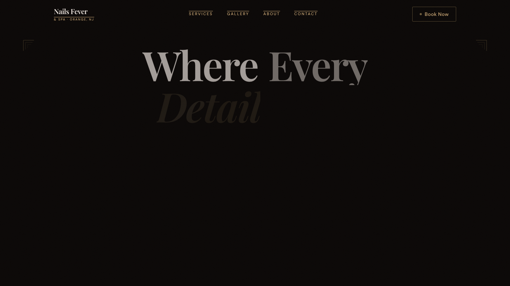
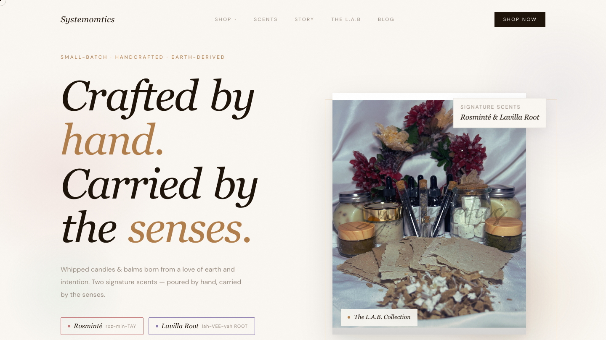
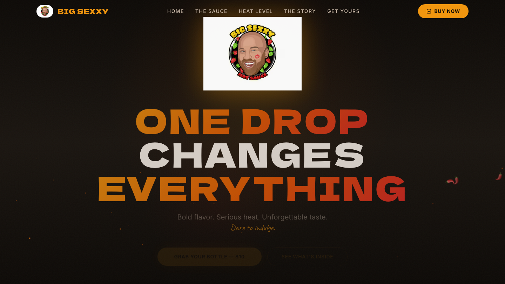
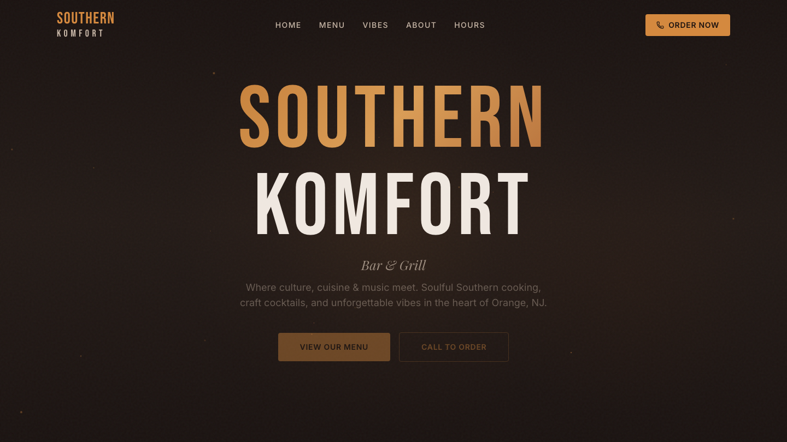
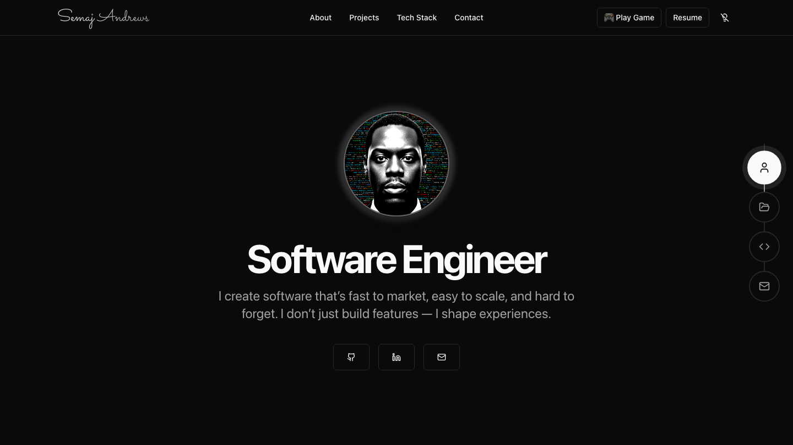
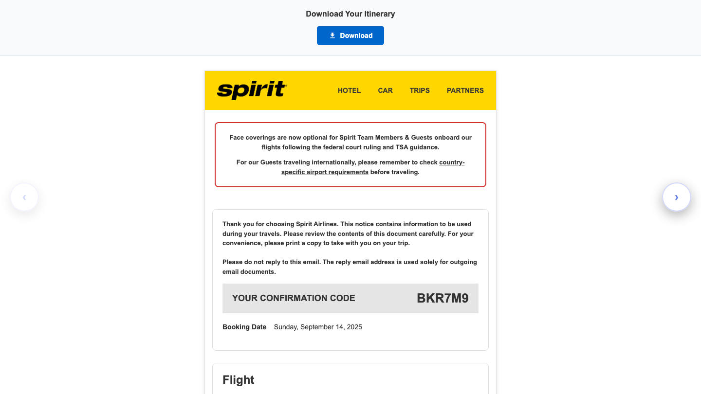

<!-- ═══════════════════════════════════════════════════════════════════════ -->
<!--                        SEMAJ Z. ANDREWS · README                         -->
<!-- ═══════════════════════════════════════════════════════════════════════ -->

 

 

<table width="100%">
<tr>
<td align="center">

> ### *I build agentic systems and ship them into production.*
>
> Engineer with 6+ years shipping production software, now focused on agentic AI. I architect and run a **multi-agent build system on the Claude API and the MCP protocol** that takes a brief to a deployed product without manual handoffs, and I have 80+ live applications generated through it. I work across the whole stack it needs — React, Next.js, TypeScript, Python, Supabase — and I own the full lifecycle from design through deployment.

</td>
</tr>
</table>

 

<!-- ───────────────────────── ACTIVE BUILDS ───────────────────────── -->

<h2 align="center">⚡ Active Builds</h2>

<table>
<tr>
<td width="50%" valign="top">

### 🤖 IGRIS
**Autonomous AI Build System**

Architected an AI-powered system that autonomously generates award-winning websites through a four-phase pipeline (Brief → Design → Atomization → Execution) with multi-agent orchestration. Produces agency-quality output in hours that traditionally costs $5K–$50K+.

`Claude API` `MCP` `Next.js` `Python` `TypeScript`

**[Case study →](https://bysemaj.com/projects/igris)**

</td>
<td width="50%" valign="top">

### 🖥️ Mac Mini Scan
**Real-Time Apple Store Inventory Locator**

Built a locator that tracks Mac Mini and Mac Studio availability across every Apple Store in the US in real time, built for the supply shortage driven by surging RAM demand and local-AI adoption. Used it to source and resell $93,000 of inventory in a single month.

`Python` `Web Scraping` `Real-Time Monitoring`

**[Case study →](https://bysemaj.com/projects/mac-mini-scan)**

</td>
</tr>
<tr>
<td width="50%" valign="top">

### 🛒 BuildWhatYouWant
**AI Sales Conversion Platform**

Developed a platform that sources leads via Google Business API, generates AI landing pages, delivers previews via QR-code with PIN access, and processes orders through Stripe with industry-specific add-ons.

`Next.js` `Stripe` `Supabase` `Google APIs`

**[Case study →](https://bysemaj.com/projects/buildwhatyouwant)**

</td>
<td width="50%" valign="top">

### 🏭 AI Software Factory
**One-Person Agency OS**

The operating system around IGRIS: a gated four-phase pipeline, six specialist agents each with their own prompt and mandate, and one spec that produces web, iOS, Android, PWA, and Chrome extension targets.

`Claude API` `MCP` `React` `Next.js` `Tailwind`

**[Case study →](https://bysemaj.com/projects/ai-software-factory)**

</td>
</tr>
</table>

 

<!-- ───────────────────────── SELECTED LIVE WORK ───────────────────────── -->

<h2 align="center">🎨 Selected Live Websites</h2>

<strong>80+ bespoke business websites designed and deployed to production</strong> <em>Each individually built (no templates), responsive, and live in the browser.</em>

<table>
  <tr>
    <td width="50%" align="center">
      
        
      <strong>Nails Fever Spa</strong> 
      Luxury dark-theme spa · Three.js · Framer Motion 
      <a href="https://nails-fever-spa.vercel.app">→ View live</a>
    </td>
    <td width="50%" align="center">
      
        
      <strong>Systemomtics</strong> 
      Editorial luxury · Cormorant italic reveal · Lenis · GSAP 
      <a href="https://systemomtics-site.vercel.app">→ View live</a>
    </td>
  </tr>
  <tr>
    <td width="50%" align="center">
      
        
      <strong>Big Sexxy Hot Sauce</strong> 
      Bold brand site · fire particle effects · Next.js 15 
      <a href="https://big-sexxy-sauce.vercel.app">→ View live</a>
    </td>
    <td width="50%" align="center">
      
        
      <strong>Southern Komfort</strong> 
      Warm smokehouse brand · Next.js 15 · Framer Motion 
      <a href="https://southern-komfort-site.vercel.app">→ View live</a>
    </td>
  </tr>
  <tr>
    <td width="50%" align="center">
      
        
      <strong>Personal Portfolio</strong> 
      Full portfolio of work · Next.js · Tailwind 
      <a href="https://semaj-portfolio-website.vercel.app">→ View live</a>
    </td>
    <td width="50%" align="center">
      
        
      <strong>Email Development Portfolio</strong> 
      Hand-coded responsive email templates · cross-client tested 
      <a href="https://email-development-portfolio.vercel.app">→ View live</a>
    </td>
  </tr>
</table>

 

<em>A curated selection from the 80+, best-first:</em>

<table align="center" width="100%">
<tr>
  <td width="50%"><a href="https://ramen-gami.vercel.app"><strong>Ramen Gami</strong></a> · Restaurant</td>
  <td width="50%"><a href="https://six-points-creative-spaces.vercel.app"><strong>Six Points Creative</strong></a> · Creative Studio</td>
</tr>
<tr>
  <td><a href="https://alpha-daycare-center.vercel.app"><strong>Alpha Daycare Center</strong></a> · Childcare</td>
  <td><a href="https://cantina-443.vercel.app"><strong>Cantina 443</strong></a> · Restaurant</td>
</tr>
<tr>
  <td><a href="https://east-orange-animal-hospital.vercel.app"><strong>East Orange Animal Hospital</strong></a> · Veterinary</td>
  <td><a href="https://more-more-now-records.vercel.app"><strong>More More Now Records</strong></a> · Record Shop</td>
</tr>
<tr>
  <td><a href="https://my-amor-coffee.vercel.app"><strong>My Amor Coffee</strong></a> · Cafe</td>
  <td><a href="https://kador-beauty-salon.vercel.app"><strong>Kador Beauty Salon</strong></a> · Beauty Salon</td>
</tr>
<tr>
  <td><a href="https://vega-jewelry.vercel.app"><strong>Vega Jewelry</strong></a> · Jewelry</td>
  <td><a href="https://gq-cutz-barber-boutique.vercel.app"><strong>GQ Cutz</strong></a> · Barbershop</td>
</tr>
</table>

<strong><a href="https://bysemaj.com">Full portfolio of all 80+ live websites at bysemaj.com →</a></strong>

 

<!-- ───────────────────────── TECH STACK ───────────────────────── -->

<h2 align="center">🧠 Core Skills</h2>

#### AI & Automation

#### Languages · Frontend · Backend · DevOps

  

<table align="center" width="100%">
<tr><td><strong>Languages</strong></td><td>Swift, Python, TypeScript, JavaScript, Java, C++, SQL, HTML, CSS</td></tr>
<tr><td><strong>Frontend</strong></td><td>React, Next.js 16, Vite, Tailwind CSS v4, GSAP, Framer Motion, Three.js, shadcn/ui</td></tr>
<tr><td><strong>Backend</strong></td><td>Node.js, tRPC, REST APIs, GraphQL, Supabase, Firebase, MySQL, PostgreSQL</td></tr>
<tr><td><strong>DevOps &amp; Tools</strong></td><td>Git, GitHub, Vercel, Cloudflare, CI/CD, Stripe, eBay API, OAuth 2.0, WCAG/VPAT</td></tr>
</table>

 

<!-- ───────────────────────── GITHUB STATS ───────────────────────── -->

<h2 align="center">📊 GitHub Activity</h2>

  

 

<!-- ───────────────────────── CURRENTLY ───────────────────────── -->

<h2 align="center">💼 Currently</h2>

<table align="center" width="100%">
<tr>
<td width="33%" align="center">
  <h3>🏢</h3>
  <strong>Founder & Forward Deployed Engineer</strong> 
  <a href="https://bysemaj.com/projects/buildwhatyouwant">BuildWhatYouWant</a> 
  June 2024 – present · 80+ live sites
</td>
<td width="33%" align="center">
  <h3>🩺</h3>
  <strong>IT Consultant</strong> 
  StationMD 
  Mobile · web · accessibility · part-time · 6 yrs
</td>
<td width="33%" align="center">
  <h3>🚀</h3>
  <strong>Open to roles</strong> 
  AI · Full-Stack · Frontend · iOS · Solutions 
  Let's talk →
</td>
</tr>
</table>

  Previously <strong>Founder &amp; Engineering Lead</strong> at ThinkQueue, 2021–2024 · product agency with a distributed team across 8 countries

 

<!-- ───────────────────────── CONNECT ───────────────────────── -->

<h2 align="center">📫 Let's Connect</h2>

  Open to <strong>AI &amp; agentic engineering</strong>, <strong>full-stack</strong>, <strong>frontend</strong>, <strong>native iOS</strong>, and <strong>forward deployed / solutions engineering</strong> roles. 
  Orange, NJ · remote, hybrid, or on-site

  
  
  

 

